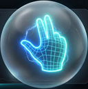

<div align="center">
  
  <h1>🖐️ YouTube Hand Control</h1>
  
  <p><b>MediaPipe</b> ve <b>Bilgisayarlı Görü</b> teknolojileri ile YouTube video oynatımını sadece el sallayarak kontrol edin.</p>

<a href="#özellikler">Özellikler</a> •
<a href="#kurulum">Kurulum</a> •
<a href="#hareketler">Hareketler</a> •
<a href="#kullanım-ve-menü">Kullanım ve Menü</a> •
<a href="#mimari">Mimari</a>

</div>

---

## 🌟 Genel Bakış

**YouTube Hand Control**, bilgisayarınızın web kamerasını kullanarak YouTube videolarında tamamen dokunmatik kontroller (oynatma, duraklatma, ses, ileri-geri sarma, hızlandırma) sağlayan yeni nesil bir Google Chrome eklentisidir. Google'ın son teknoloji **MediaPipe Hands** kütüphanesini kullanarak %100 yerel olarak cihazınızda çalışır, yani herhangi bir bulut sunucusuna görüntü göndermez. Geleceği deneyimlemeye hazır olun.

Elleriniz yemekten kirlenmiş de olsa, resim yaparken ya da sadece bir Jedi gibi hissetmek istediğinizde, bu eklenti video izleme deneyiminize sihirli bir dokunuş katar.

## ✨ Özellikler

- **Çimdikleyerek Ses Kontrolü (Önerilmez)**: İşaret parmağınızı ve başparmağınızı çimdikleyerek sesi dinamik olarak değiştirin. İki parmak arasındaki mesafe, ses seviyesini gerçek zamanlı olarak ayarlar.
- **Çift El ile Tam Ekran**: Her iki elinizi de kameraya açık bir şekilde göstererek sinematik bir deneyim için videoyu anında tam ekrana alın.
- **Gelişmiş Yatay Navigasyon**: Elinizi sağa veya sola işaret ederek videoyu 10 saniye ileri veya geri sarın, veya avuç içinizi döndürerek videolar arası kolayca geçiş yapın.
- **Trigonometrik Kararlılık & Kusursuz Algılama**: Eski nesil "noktalar arası uzunluk (Euclidean)" ölçme sisteminden **Trigonometrik Açı (Math.atan2)** hesaplama altyapısına geçildi. Eller kameraya ne kadar yakın veya uzak olursa olsun; hafif eğik mi, dik mi olduğu milisaniyeler içinde kusursuzca ayrıştırılır. Çakışma veya yanlış algılama imkansız hale getirildi.
- **Midas Dokunuşu Koruması**: Yerleşik 600ms _Bekleme Süresi (Dwell Time)_ mekanizması sayesinde sistem sadece kasıtlı yapılan hareketleri algılar, elinizin yanlışlıkla kameraya çarpması eylemleri tetiklemez.
- **Sıfır Gecikme & Gizlilik Odaklı**: Tüm makine öğrenimi süreçleri (MediaPipe WebAssembly ile) bir _Offscreen Document_ (Görünmez Belge) üzerinden lokal olarak çalışır. Hiçbir kamera görüntüsü internetteki bir sunucuya gönderilmez. Maksimum gizlilik!
- **Akıcı Kullanıcı Arayüzü (UI)**: Hareketleri ne kadar başarılı yaptığınızı ve eylemlerin sonucunu anında gösteren, rahatsız etmeyen, cam (glassmorphism) efektli bir HUD ekrana yansıtılır.
- **Akıllı Güç Tasarrufu**: Manifest V3 Service Worker teknolojisini kullanarak bataryadan tasarruf eder ve kamerayı yalnızca ihtiyaç duyulduğunda çalıştırır.

## 🎯 Desteklenen Hareketler

| Hareket                | İkon  | Varsayılan Eylem       | Açıklama                                                                                       |
| :--------------------- | :---: | :--------------------- | :--------------------------------------------------------------------------------------------- |
| **Çift El**            |  👐   | **Tam Ekran**          | İki elinizi açık ve yan yana tutarak videoyu tam ekran moduna geçirin veya çıkın.              |
| **Çimdik (Önerilmez)** |  🤏   | **Gerçek Zamanlı Ses** | İşaret ile başparmağınızı birbirine yaklaştırarak sesi kısın ya da uzaklaştırarak açın.        |
| **Açık El**            |  ✋   | **Oynat / Duraklat**   | Videoyu durdurmak veya oynatmak için düz ve açık bir el gösterin.                              |
| **İşaret Yukarı**      |  ☝️   | **Sesi Kapat / Aç**    | Sadece işaret parmağınızı havaya kaldırarak sesi tamamen kapatıp açın.                         |
| **Sağ / Sol Avuç**     | 🫱/🫲 | **Hızlandır/Yavaşlat** | Avuç içinizi yana çevirerek videonun oynatma hızını ±0.25 oranında artırıp azaltın.            |
| **Sağa / Sola İşaret** | 👉/👈 | **10 Sn İleri/Geri**   | İşaret parmağınızla yön belirterek videoyu hızlıca 10 saniye atlatın.                          |
| **Zafer İşareti**      |  ✌️   | **Sesi Kapat / Aç**    | Sesin tamamen kapanmasını ya da açılmasını sağlamak için işaret ve orta parmağınızı "V" yapın. |

_(Not: Bu eylemlerin tümü eklenti menüsündeki açılır listeler aracılığıyla kendi zevkinize göre değiştirilebilir)_

## 🎮 Kullanım ve Menü

Eklentiyi yükledikten sonra, Chrome araç çubuğunda el şeklindeki ikonumuza (🖐️) tıklayarak ana menüyü açabilirsiniz. Ana menü son derece anlaşılır ve özelleştirilebilir şekilde tasarlanmıştır:

### Ana Kontrol Anahtarı (Master Switch)

Menünün en üstünde yer alan anahtar, **Kamerayı ve Eklentiyi Aç/Kapat**manızı sağlar.

- **Açık Konum:** Kamera aktifleşir, MediaPipe motoru arkaplanda çalışmaya başlar ve YouTube'da el hareketlerinizi dinlemeye başlar.
- **Kapalı Konum:** Kamera tamamen kapanır, eklenti tüm donanım serbest bırakır ve işlemci tüketimini **Sıfır'a** indirir.

### Hareket ve Eylem Özelleştirme

Kameranın altındaki listede 10 farklı el hareketini (Çift El, Açık El, İşaret Yukarı, Sağ/Sol Avuç, 👉/👈 vb.) göreceksiniz.

1. **Toggle/Switch Düğmesi:** İlgili hareketi tamamen devre dışı bırakmak veya tekrar açmak için kullanılır. Sevmediğiniz veya kazara kendi kendinize çok yaptığınız bir el hareketi varsa yanındaki düğmeden o hareketi susturabilirsiniz.
2. **Açılır Menü (Dropdown):** Her hareketin yanındaki açılır menüden, bu hareket yapıldığında YouTube'da hangi işlevin tetikleneceğini seçebilirsiniz. Örneğin "Yumruk" yaptığınızda "İleri Sar" yerine "Duraklat" işlevinin çalışmasını istiyorsanız açılır menüden özgürce ayarlayabilir, kendi favori düzeninizi yaratabilirsiniz.

_Seçtiğiniz tüm ayarlar Chrome belleğine otomatik kaydedilir; sekmeyi veya tarayıcıyı kapatsanız dahi eklenti tercihlerinizi hatırlar._

## 🚀 Kurulum (Geliştirici Modu)

Bu eklenti Chrome Web Mağazasında olmadığı için Geliştirici Modunu kullanarak saniyeler içinde Chrome'a yükleyebilirsiniz.

1. Projeyi bilgisayarınıza indirin (Clone):
   ```bash
   git clone https://github.com/EnesAhmet10000/YT-Hand-Controller.git
   ```
2. Google Chrome'u açın ve adres çubuğuna `chrome://extensions/` yazın.
3. Sağ üst köşedeki **Geliştirici Modu (Developer mode)** butonunu aktif hale getirin.
4. Sol üstteki **Paketlenmemiş öğe yükle (Load unpacked)** düğmesine tıklayın.
5. Klasörü indirdiğiniz `YT-Hand-Controller` dizinini seçin.
6. Eklentiniz artık kuruldu! Dilerseniz adres çubuğunun yanındaki yapboz (🧩) simgesinden eklentiyi sabitleyebilirsiniz.

## ⚙️ Nasıl Çalışıyor? (Mimari)

En güncel **Manifest V3** standartlarıyla inşa edilen eklenti, üçlü bir mimariye sahiptir:

- **`background.js` (Service Worker)**: Eklentinin beynidir. Kameranın Açık/Kapalı durumunu yönetir ve "Görünmez Sürücü (Offscreen)" belgesini hayatta tutmak için sürekli bir `KEEP_ALIVE` nabzı gönderir.
- **`offscreen.js` (Görünmez Sürücü)**: Ağır işlerin yapıldığı kısımdır. Kameraya erişir, MediaPipe WebAssembly'i yükler ve ~30 FPS hızda el hareketlerini yüksek doğrulukla arka planda hesaplar. Duruş bozukluklarını (derinlik / uzaklık) ekarte etmek için x ekseni sapmalarını değil doğrudan bilek-parmak arasındaki eksen açısını **(Trigonometri ile)** hesaplayan güncel bir algoritmaya sahiptir.
- **`content.js` (İçerik Betiği)**: Doğrudan YouTube sayfasının içine yerleşir. Olayları dinler, YouTube'un HTML5 `<video>` elementine müdahale ederek eylemleri yansıtır ve size o şık kullanıcı arayüzünü (Toast, Progress vb.) çizer.

## 🤝 Katkıda Bulunma

Projeyi geliştirmeye, hataları (issues) bildirmeye veya yeni özellikler eklemeye sonuna kadar açığız. Bir yıldız (⭐️) vermeyi unutmayın!

---

<div align="center">
  <i>"Multimedya için dokunmasız bir gelecek."</i>
</div>
# YT-Hand-Controller
